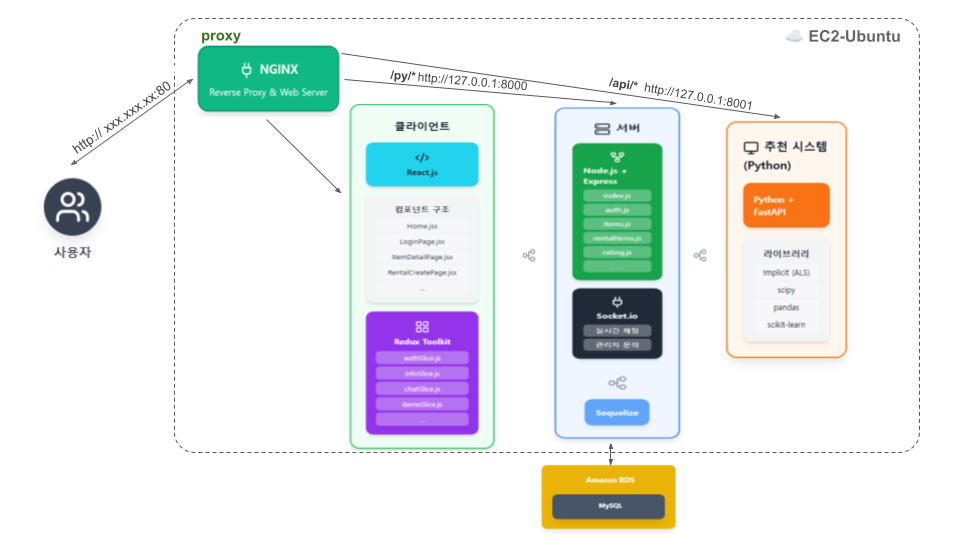
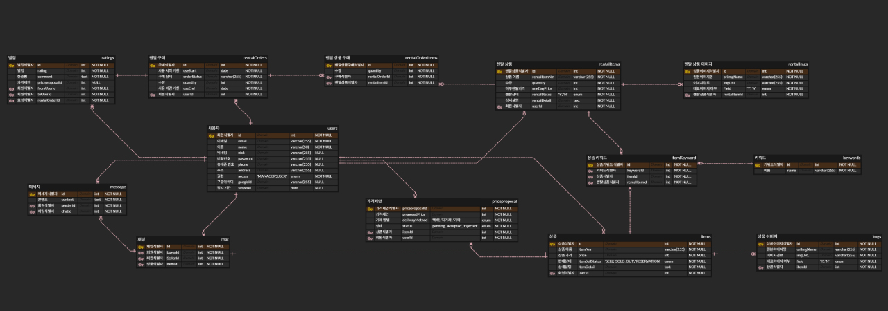

   

## S&R, 나비: 나누고, 비우고

중고상품거래, 중고렌탈 리커머스 사이트

## 개발기간

25.06.25 ~ 25.07.25

## 소개

기존 중고 거래 사이트들의 가장 불편한 점이 뭘까? 바로 <b>채팅 의존적인 네고 시스템</b> 
끝없는 가격 네고 채팅, 애매한 가격 제시와 거래 방법에 인한 시간 낭비, 채팅 부담으로 포기하는 거래들을 떠올리며 기획한 사이트입니다. 

시험 기간에만 필요한 전공책, 여행 때만 쓸 캠핑용품, 한 달만 볼 ott 이런 걸 위해 전액을 지불하는 게 합리적일까? 
나비는 <b>중고 거래 뿐만 아니라 렌탈 서비스도 함께 제공합니다.</b>

---

## 팀원 소개

| 이름   | 역할                                     | GitHub                                   |
| ------ | ---------------------------------------- | ---------------------------------------- |
| 황민영 | 팀장(프론트엔드, 실시간 채팅)            | [링크](https://github.com/wainou06)      |
| 전예은 | 팀원(백엔드, 상품 및 렌탈)               | [링크](https://github.com/yeni0727)      |
| 전준모 | 팀원(백엔드, 로그인/회원가입 및 내 정보) | [링크](https://github.com/aggawa)        |
| 차민준 | 팀원(백엔드, 별점 시스템 및 키워드 관리) | [링크](https://github.com/blessserenity) |

---

## 기술 스택

-  **🖥 Front-end (React v19.1.0)**

   -  **SWIPERJS**: swiperjs.com (슬라이드 컴포넌트)
   -  **@mui/material / @mui/icons-material**: UI 컴포넌트 & 아이콘 스타일링
   -  **@reduxjs/toolkit, react-redux, redux, reselect**: 상태 관리 (Redux + Selector 최적화)
   -  **react-router-dom**: 클라이언트 사이드 라우팅
   -  **socket.io-client**: WebSocket 기반 실시간 통신
   -  **axios**: HTTP 클라이언트
   -  **dayjs**: 날짜 및 시간 처리

-  **🛠 Back-end (Node.js v22.11.0)**

   -  **Express**: 웹 프레임 워크
   -  **Jsonwebtoken**: JWT 기반 인증
   -  **passport, passport-local**: OAuth 및 로컬 인증
   -  **bcrypt**: 비밀번호 해싱
   -  **express-session, cookie-parser**: 세션 및 쿠키 관리
   -  **socket.io**: WebSocket 기반 실시간 통신
   -  **multer**: 파일 업로드 처리
   -  **dotenv**: 환경 변수 관리
   -  **cors**: CORS 정책 설정

-  **🗄 Database (MySQL)**

   -  **MySQL2**: Node.js용 MySQL 클라이언트
   -  **Sequelize**: ORM (객체 관계 매핑) → 모델 정의 및 쿼리 단순화
   -  **MySQL Workbench / DBeaver**: DB 시각화 및 관리 툴

-  **📊 Machine Learning (Python + FastAPI)**

   -  **FastAPI**: 추천 시스템 API 서버 제공
   -  **pandas**: 데이터 전처리 및 집계
   -  **scikit-learn (LabelEncoder)**: 범주형 데이터 인코딩
   -  **scipy (coo_matrix, csr_matrix)**: 희소 행렬 변환
   -  **implicit (ALS)**: 협업 필터링 기반 추천 알고리즘

-  **🌐 Deploy**

   -  **AWS EC2 Ubuntu**: 백엔드, 프론트엔드, 머신러닝 배포
   -  **AWS RDS**: Mysql 배포
   -  **Nginx**: proxy 설정

---

### **🥳 회원가입**

-  **중복 확인**

   -  **이메일과 닉네임**: 이메일 또는 닉네임이 중복일시 회원가입을 진행할 수 없도록 하여 중복을 막도록 했습니다.

-  **유효성 검사**

   -  **유효성 검사**: 이메일 입력시 이메일 형식이 아닐 경우 회원가입이 불가하고, 비밀번호 입력시 영문, 숫자, 특수문자를 조합한 8자리 이상이 아니라면 회원가입이 불가능하도록 했습니다.

### **👤 로그인**

-  **로그인**

   -  **로그인**: 로그인시 DB에 저장된 회원 정보와 비교하여 일치시 로그인을 일치하지 않을시 상황에 맞는 오류 메세지를 보여줍니다.

-  **구글 연동 로그인**

   -  **구글 연동 로그인**: 구글 연동 로그인시 Oauth 2.0을 기반으로 인증을 합니다. Google에서 제공하는 프로필, 이메일 정보를 기반으로 서비스 내 사용자 계정을 자동 생성 및 로그인 처리합니다.

-  **이메일 저장**

   -  **이메일 저장**: 이메일 저장 체크박스 체크시 로그인 후 다음 로그인 때 텍스트 필드에 아이디가 저장됩니다.

-  **임시 비밀번호 생성**

   -  **이메일, 휴대폰 번호로 생성**: 이메일 혹은 휴대폰 번호를 사용해 임시 비밀번호를 받을 수 있습니다.

### **✍️ 내 정보 관리**

-  **프로필 정보 수정**

   -  **프로필 정보 수정**: 내 프로필 수정 시 닉네임, 전화번호, 주소를 수정할 수 있습니다. 수정 시 DB에 수정된 정보가 업데이트 됩니다.
  
-  **보안설정**

   -  **비밀번호 수정**: 비밀번호 수정 시 새 비밀번호를 받아, DB에 저장된 정보가 업데이트 됩니다.

---

### **🛍️ 중고 상품 관리**

-  **상품 상세 및 거래**

   -  **권한별 기능 분리**: 판매자, 구매자, 관리자 등 역할에 따라 다른 UI와 기능을 제공합니다.
   -  **실시간 상태 관리**: 가격 제안, 거래 진행 등 상품의 상태가 실시간으로 변경되고, 이에 따라 화면이 업데이트됩니다.

### **🛒 렌탈 상품 관리**

-  **렌탈 예약 시스템**

   -  **날짜 기반 예약**: 달력을 통해 렌탈 시작일과 종료일을 선택하고, 총 렌탈 금액을 실시간으로 계산하여 보여줍니다.

-  **재고 관리**

   -  **자동 재고 복구**: 렌탈 기간이 만료되면 백엔드 배치 시스템이 자동으로 재고 수량을 복구합니다.
   -  **렌탈 현황 조회**: 렌탈 상품 소유자는 현재 예약된 주문 목록을 확인할 수 있습니다.
   -  **배치 작업**: 렌탈 기간이 끝난 상품의 재고를 자동으로 복구하고, 주문 상태를 '완료'로 변경하는 작업을 1분 단위로 실행합니다.
   -  **트랜잭션 처리**: 데이터의 일관성과 안정성을 보장하기 위해 모든 배치 작업은 트랜잭션을 기반으로 처리된다.

---

### **🔎 키워드 관리**

-  **데이터 관리**

   -  **관리자**: 관리자가 직접 키워드를 등록/수정/삭제 하도록 했습니다.
   -  **사용자**: 관리자가 추가한 키워드를 사용자에게 넘겨, 리스트를 통해 키워드를 선택할 수 있습니다.

-  **키워드 관리**

   -  **등록**: 추가할 키워드에 이름을 입력한 후 저장, 존재하는 키워드일 경우 에러를 출력합니다.
   -  **수정/삭제**: 키워드 선택 후, 수정할 키워드에서 수정 및 삭제 가능.

### **📈 관리자 대시보드**

-  **사용자관리**

   -  **계정 정지**: 정지 기간이 남았을 경우 남은 정지 일수 출력, 정지 기간이 지났거나 없다면 stop을 출력하게 함. 해당 텍스트를 눌렀다면 정지 일수를 입력하여 기간을 늘리거나 줄인다.
   -  **계정 삭제**: delete로 표시. 해당 버튼 클릭 시 확인과 삭제하려는 해당 유저의 이름을 입력하여 맞다면 삭제힐 수 있도록 했습니다.

-  **별점 통계**

   -  **통계**: 관리자가 사용자관리 창에서 유저를 클릭하여 해당 유저의 별점 추이를 확인합니다. Y축은 별점(1 ~ 5), X축은 받은 횟수(n번째)를 나타냅니다.

###  **⭐추천 시스템**

   -  **별점 기반**: 구매자가 직접 판매자의 점수/평점을 남길 수 있습니다. (Explicit Feedback) 별점(1~5점)을 주기 때문에, 선호도를 명시적으로 표현합니다. 모델은 데이터를 그대로 학습하여 별점이 높은 사용자가 올리는 상품을 추천해줍니다.

---

### **💬 실시간 채팅**

-  **판매자 - 구매자간 채팅**

   -  **거래 채팅**: 구매자의 가격 제안을 판매자가 수락할 때, 채팅방을 새로 생성하고 그 구매자와 실시간 채팅이 시작됩니다.

-  **관리자 - 사용자간 채팅**

   -  **고객센터**: 사용자가 고객센터 메뉴를 클릭할 때, 채팅방이 생성되고 관리자와 실시간 채팅이 시작됩니다.

---

### 시스템 아키텍처
   

### ERD
   

---

